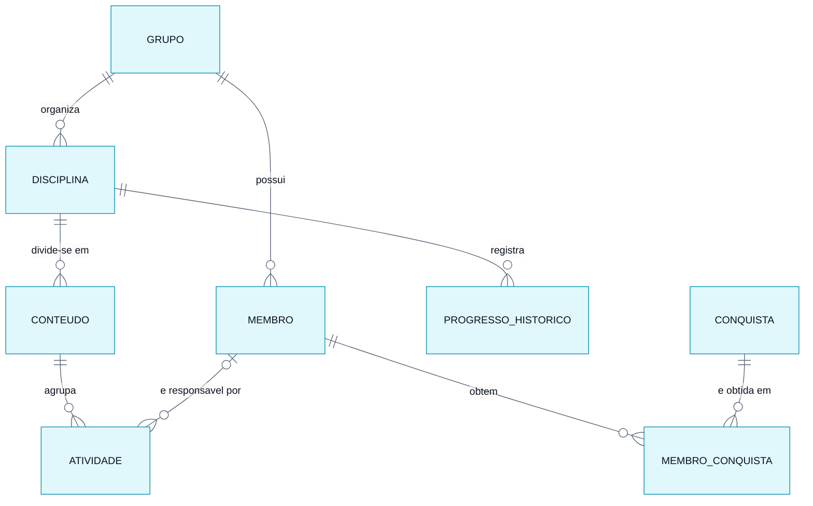

# Modelo Conceitual do Banco de Dados

> **Vértice** — Plataforma de Acompanhamento de Aprendizagem
> Entrega 2 · Modelagem do Banco de Dados · Equipe 7

---

O modelo conceitual identifica **o que** o sistema precisa guardar, sem decidir ainda como isso será implementado. As entidades foram extraídas dos substantivos que aparecem nos requisitos: grupo (RF01), membro (RF02), disciplina (RF13), conteúdo (RF14), atividade (RF03), histórico de progresso (RF12) e conquista (RF17).

---

## Diagrama entidade-relacionamento

> Versão em imagem para inserir no documento: [`modelo-conceitual.png`](modelo-conceitual.png)

---

## Entidades e atributos

| Entidade | Atributos | Origem |
|---|---|---|
| **GRUPO** | identificador, nome, descrição, data de criação | RF01 |
| **MEMBRO** | identificador, nome, função, e-mail, avatar, perfil | RF02 |
| **DISCIPLINA** | identificador, nome, cor de identificação, data de criação | RF13 |
| **CONTEUDO** | identificador, nome, descrição, ordem de apresentação | RF14 |
| **ATIVIDADE** | identificador, título, descrição, prazo, peso, prioridade, status, data de criação, data de conclusão | RF03, RN09 |
| **PROGRESSO_HISTORICO** | identificador, data do registro, percentual | RF12 |
| **CONQUISTA** | identificador, código, nome, descrição, ícone, tipo de critério, valor do critério | RF17 |
| **MEMBRO_CONQUISTA** | data de obtenção | RN12 |

---

## Relacionamentos e cardinalidades

| Relacionamento | Cardinalidade | Leitura |
|---|---|---|
| GRUPO **possui** MEMBRO | 1 : N | Um grupo possui zero ou muitos membros; cada membro pertence a exatamente um grupo |
| GRUPO **organiza** DISCIPLINA | 1 : N | Um grupo organiza zero ou muitas disciplinas; cada disciplina pertence a exatamente um grupo |
| DISCIPLINA **divide-se em** CONTEUDO | 1 : N | Uma disciplina divide-se em zero ou muitos conteúdos; cada conteúdo pertence a exatamente uma disciplina |
| CONTEUDO **agrupa** ATIVIDADE | 1 : N | Um conteúdo agrupa zero ou muitas atividades; cada atividade pertence a exatamente um conteúdo |
| MEMBRO **é responsável por** ATIVIDADE | 0..1 : N | Um membro é responsável por zero ou muitas atividades; uma atividade tem no máximo um responsável e pode ficar sem nenhum |
| DISCIPLINA **registra** PROGRESSO_HISTORICO | 1 : N | Uma disciplina acumula zero ou muitos registros de progresso; cada registro pertence a uma única disciplina |
| MEMBRO **obtém** CONQUISTA | N : N | Um membro obtém várias conquistas e uma conquista é obtida por vários membros |

---

## Decisões do modelo

**Por que disciplina e conteúdo são entidades, e não campos da atividade.** Na versão anterior do sistema, "disciplina" era um texto digitado dentro da atividade. Com isso, "Banco de Dados" e "banco de dados" viravam duas disciplinas diferentes e não havia onde ancorar o progresso. Os requisitos RF10 e RF11 exigem um percentual por conteúdo e por disciplina, o que só é possível se ambos existirem como registros próprios com atividades vinculadas.

**Por que a atividade não guarda o grupo.** O grupo de uma atividade é alcançado pelo caminho ATIVIDADE → CONTEUDO → DISCIPLINA → GRUPO. Guardar o identificador do grupo diretamente na atividade criaria um caminho alternativo que poderia divergir do primeiro — uma atividade poderia apontar para o grupo A e, pelo conteúdo, para o grupo B.

**Por que existe MEMBRO_CONQUISTA.** O relacionamento entre membro e conquista é muitos-para-muitos e carrega um dado próprio: a data em que a conquista foi obtida. Esse dado não pertence nem ao membro nem à conquista, e sim ao encontro dos dois, o que exige a entidade associativa.

**Por que o progresso histórico é uma entidade.** O percentual atual de uma disciplina pode ser calculado a qualquer momento a partir das atividades. Já a evolução ao longo do tempo (RF12) não pode: não há como saber, olhando o estado de hoje, qual era o percentual há duas semanas. Por isso o valor diário precisa ser gravado.

**O que não virou entidade.** Experiência, ofensiva e percentual de progresso atual são valores derivados das atividades concluídas e das suas datas, calculados no momento da consulta. Não receberam entidade nem campo próprio para evitar uma segunda fonte de verdade, que precisaria ser corrigida a cada estorno previsto na RN10.

---

### Navegação

[⬅ Diagramas](../diagramas/04-atividade-cadastrar.md) · [Índice](../README.md) · [Próximo: Modelo Lógico ➡](02-modelo-logico.md)
