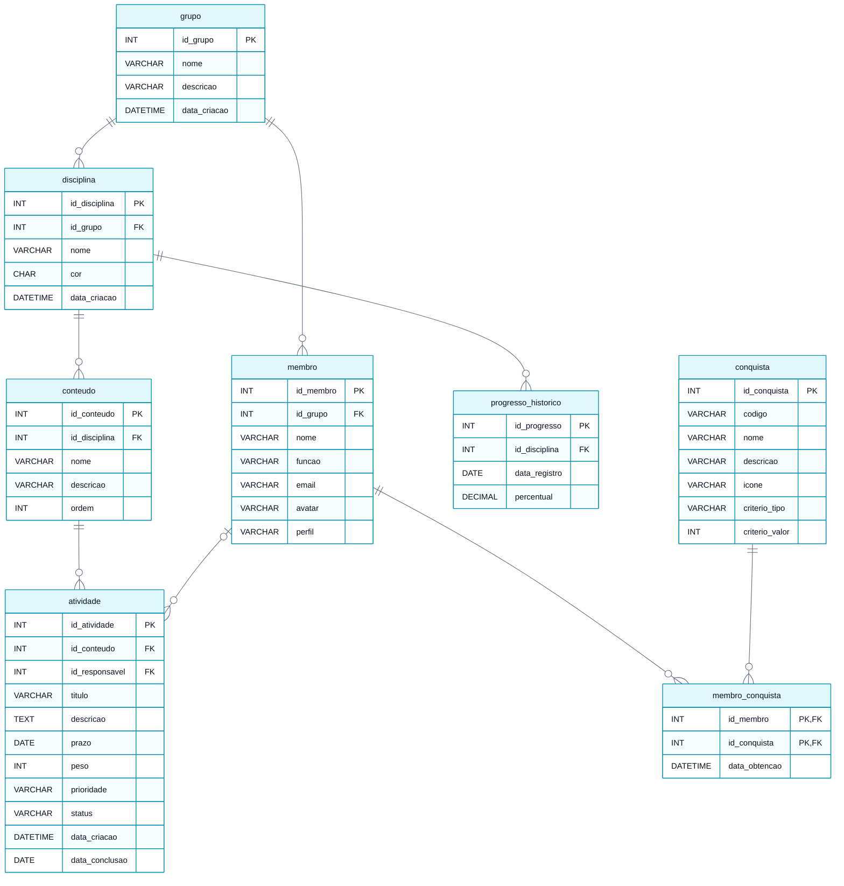

# Modelo Lógico do Banco de Dados

> **Vértice** — Plataforma de Acompanhamento de Aprendizagem
> Entrega 2 · Modelagem do Banco de Dados · Equipe 7

---

O modelo lógico transforma as entidades do [modelo conceitual](01-modelo-conceitual.md) em tabelas, com chaves primárias, chaves estrangeiras, tipos de dados e restrições. O relacionamento muitos-para-muitos entre membro e conquista foi resolvido pela tabela associativa `membro_conquista`.

---

## Diagrama do modelo lógico

> Versão em imagem para inserir no documento: [`modelo-logico.png`](modelo-logico.png)

---

## Tabelas

### grupo

| Campo | Tipo | Chave | Nulo | Restrição |
|---|---|---|---|---|
| id_grupo | INT | PK | Não | Auto incremento |
| nome | VARCHAR(80) | — | Não | — |
| descricao | VARCHAR(255) | — | Sim | — |
| data_criacao | DATETIME | — | Não | Padrão: data e hora atuais |

### membro

| Campo | Tipo | Chave | Nulo | Restrição |
|---|---|---|---|---|
| id_membro | INT | PK | Não | Auto incremento |
| id_grupo | INT | FK → grupo | Não | `ON DELETE CASCADE` (RN02) |
| nome | VARCHAR(80) | — | Não | — |
| funcao | VARCHAR(60) | — | Sim | — |
| email | VARCHAR(120) | — | Sim | — |
| avatar | VARCHAR(60) | — | Sim | Semente do avatar gerado |
| perfil | VARCHAR(15) | — | Não | `CHECK IN ('organizador', 'participante')` (RN07) |

### disciplina

| Campo | Tipo | Chave | Nulo | Restrição |
|---|---|---|---|---|
| id_disciplina | INT | PK | Não | Auto incremento |
| id_grupo | INT | FK → grupo | Não | `ON DELETE CASCADE` (RN02) |
| nome | VARCHAR(80) | — | Não | `UNIQUE (id_grupo, nome)` |
| cor | CHAR(7) | — | Sim | Formato hexadecimal, ex.: `#22D3EE` |
| data_criacao | DATETIME | — | Não | Padrão: data e hora atuais |

### conteudo

| Campo | Tipo | Chave | Nulo | Restrição |
|---|---|---|---|---|
| id_conteudo | INT | PK | Não | Auto incremento |
| id_disciplina | INT | FK → disciplina | Não | `ON DELETE CASCADE` (RN02, RN13) |
| nome | VARCHAR(80) | — | Não | `UNIQUE (id_disciplina, nome)` |
| descricao | VARCHAR(255) | — | Sim | — |
| ordem | INT | — | Não | Padrão: 1 |

### atividade

| Campo | Tipo | Chave | Nulo | Restrição |
|---|---|---|---|---|
| id_atividade | INT | PK | Não | Auto incremento |
| id_conteudo | INT | FK → conteudo | Não | `ON DELETE CASCADE` (RN13) |
| id_responsavel | INT | FK → membro | Sim | `ON DELETE SET NULL` (RN02) |
| titulo | VARCHAR(120) | — | Não | `CHECK (LENGTH(titulo) >= 3)` (RN06) |
| descricao | TEXT | — | Sim | — |
| prazo | DATE | — | Não | (RN06) |
| peso | INT | — | Não | Padrão 1, `CHECK (peso BETWEEN 1 AND 5)` (RN09) |
| prioridade | VARCHAR(10) | — | Sim | `CHECK IN ('baixa', 'media', 'alta')` |
| status | VARCHAR(12) | — | Não | Padrão `'a fazer'`, `CHECK IN ('a fazer', 'fazendo', 'concluido')` (RN04) |
| data_criacao | DATETIME | — | Não | Padrão: data e hora atuais |
| data_conclusao | DATE | — | Sim | Preenchida quando o status passa a `'concluido'` (RN11) |

### progresso_historico

| Campo | Tipo | Chave | Nulo | Restrição |
|---|---|---|---|---|
| id_progresso | INT | PK | Não | Auto incremento |
| id_disciplina | INT | FK → disciplina | Não | `ON DELETE CASCADE` |
| data_registro | DATE | — | Não | `UNIQUE (id_disciplina, data_registro)` |
| percentual | DECIMAL(5,2) | — | Não | `CHECK (percentual BETWEEN 0 AND 100)` |

### conquista

| Campo | Tipo | Chave | Nulo | Restrição |
|---|---|---|---|---|
| id_conquista | INT | PK | Não | Auto incremento |
| codigo | VARCHAR(30) | — | Não | `UNIQUE` |
| nome | VARCHAR(60) | — | Não | — |
| descricao | VARCHAR(160) | — | Não | — |
| icone | VARCHAR(10) | — | Sim | — |
| criterio_tipo | VARCHAR(30) | — | Não | `CHECK IN ('atividades_concluidas', 'conteudo_completo', 'disciplina_completa', 'ofensiva_dias', 'experiencia_total')` |
| criterio_valor | INT | — | Não | Valor a ser atingido no critério |

### membro_conquista *(tabela associativa)*

| Campo | Tipo | Chave | Nulo | Restrição |
|---|---|---|---|---|
| id_membro | INT | PK, FK → membro | Não | `ON DELETE CASCADE` |
| id_conquista | INT | PK, FK → conquista | Não | `ON DELETE CASCADE` |
| data_obtencao | DATETIME | — | Não | Padrão: data e hora atuais |

A chave primária composta por `id_membro` e `id_conquista` é o que garante a RN12: o banco recusa uma segunda concessão da mesma conquista ao mesmo estudante.

---

## Como as regras de negócio aparecem no banco

| Regra | Implementação no modelo lógico |
|---|---|
| RN02 — exclusão em cascata | `ON DELETE CASCADE` nas chaves estrangeiras de `membro`, `disciplina`, `conteudo` e `atividade`; `ON DELETE SET NULL` em `atividade.id_responsavel` |
| RN04 — status válido e padrão | `CHECK` na coluna `status` mais valor padrão `'a fazer'` |
| RN06 — título e prazo obrigatórios | `NOT NULL` em `titulo` e `prazo`, mais `CHECK` de comprimento mínimo do título |
| RN07 — perfis de usuário | `CHECK` na coluna `perfil` |
| RN09 — faixa e padrão do peso | `CHECK (peso BETWEEN 1 AND 5)` mais valor padrão 1 |
| RN12 — conquista concedida uma única vez | Chave primária composta em `membro_conquista` |
| RN13 — vínculo obrigatório com conteúdo | `id_conteudo NOT NULL` em `atividade` |

### Regras que o banco não consegue garantir sozinho

| Regra | Por quê | Onde será tratada |
|---|---|---|
| RN03 — o responsável deve ser membro do mesmo grupo da atividade | A chave estrangeira garante que o responsável é um membro **existente**, mas não que ele pertence ao grupo alcançado por `atividade → conteudo → disciplina → grupo` | Validação na aplicação, no momento do cadastro, oferecendo na lista apenas os membros do grupo ativo |
| RN08, RN14 — cálculo do progresso | São fórmulas de agregação, não restrições de integridade | Consulta com `SUM` sobre o peso das atividades, executada na aplicação |
| RN10, RN11 — experiência e ofensiva | Valores derivados de `peso` e de `data_conclusao` | Cálculo na aplicação a partir das atividades concluídas |

---

## Nota sobre a implementação da primeira versão

Conforme a restrição de persistência registrada no [Escopo](../docs/05-escopo.md), a primeira versão do sistema guarda os dados no navegador. A estrutura utilizada reproduz este modelo lógico: uma coleção por tabela, com os mesmos nomes de campo, os mesmos identificadores e as mesmas chaves estrangeiras. As restrições `CHECK`, `NOT NULL` e a unicidade são aplicadas por validação na aplicação. A migração para um servidor de banco de dados relacional consiste em criar as tabelas descritas acima e substituir a camada de acesso, sem alterar o modelo.

---

### Navegação

[⬅ Anterior: Modelo Conceitual](01-modelo-conceitual.md) · [Índice](../README.md) · [Próximo: Dicionário de Dados ➡](03-dicionario-de-dados.md)
