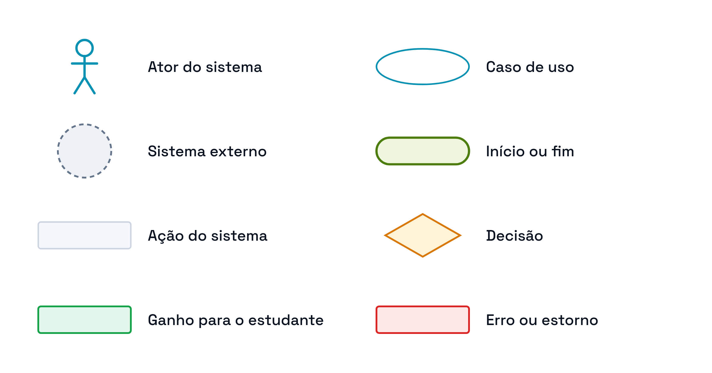

# Identidade visual dos diagramas

> **Vértice** — Plataforma de Acompanhamento de Aprendizagem
> Entrega 2 · Modelagem do Software · Equipe 7

---

Os diagramas deste repositório usam o mesmo sistema de cores e a mesma tipografia da aplicação, definidos em `src/styles/theme.js`. A intenção é que documento, modelos e telas sejam lidos como o mesmo produto, e não como artefatos produzidos em ferramentas diferentes.

---

## Paleta

| Papel | Cor | Onde aparece nos diagramas |
|---|---|---|
| Ciano — marca e ações principais | `#0891B2` | Atores, casos de uso e entidades do núcleo do domínio |
| Verde limão — acento da marca | `#4D7C0F` | Início e fim dos fluxos, classe associativa |
| Âmbar — status "fazendo" e alerta | `#D97706` | Losangos de decisão e avisos |
| Verde — status "concluído" | `#16A34A` | Passos que geram ganho para o estudante: experiência, conquista, progresso |
| Rosa — perigo | `#DC2626` | Erros de validação e estorno de experiência |
| Cinza-azulado — neutro | `#64748B` | Sistemas externos, enumerações e ações sem efeito no progresso |

As cores são as da paleta `coresClaras` do arquivo de tema, escolhida por atravessar bem os três meios em que os diagramas serão vistos: o documento entregue, a impressão e a leitura no GitHub. Nenhuma cor foi inventada para os diagramas.

---

## Tipografia

| Uso | Fonte |
|---|---|
| Rótulos de nós, entidades e classes | **Space Grotesk** — a mesma do corpo de texto da aplicação |
| Rótulos de transição e de relacionamento | **Space Mono** — a mesma dos rótulos de dados da interface |

Ambas são servidas pelo Google Fonts, que por isso conta como dependência externa da aplicação (Doc. 05 — Restrições). Não deixam de ser lidas quando o serviço está fora do ar: o navegador recai na fonte sem serifa do sistema, e só a tipografia muda.

---

## Vocabulário de formas

> Desenho-fonte: [`svg/legenda.svg`](svg/legenda.svg) · Imagem para o documento: [`png/legenda.png`](png/legenda.png)

| Forma | Significado |
|---|---|
| Boneco palito ciano | Ator do sistema — a pessoa que inicia a interação |
| Círculo cinza tracejado | Sistema externo — participa, mas não inicia nada e não é pessoa |
| Elipse com borda ciano | Caso de uso |
| Pílula verde limão | Início e fim de um fluxo |
| Retângulo neutro | Ação executada pelo usuário ou pelo sistema |
| Losango âmbar | Ponto de decisão, sempre com as saídas rotuladas |
| Retângulo verde | Passo que devolve ganho ao estudante |
| Retângulo rosa | Erro de validação ou estorno |

A distinção entre as duas primeiras formas é proposital: **o boneco palito representa apenas o ator que é pessoa**. Serviço de software consumido pelo sistema aparece como círculo tracejado, com o estereótipo «sistema externo» escrito embaixo.

---

## Como os diagramas são mantidos

Todos os diagramas são mantidos como texto, não como arquivos de ferramenta de desenho. Alterar um diagrama é editar código, e o histórico do Git mostra exatamente o que mudou.

| Diagrama | Fonte | Por quê |
|---|---|---|
| Classes, atividades, modelo conceitual, modelo lógico | Mermaid, dentro do próprio `.md` | O GitHub renderiza automaticamente |
| Casos de uso e esta legenda | SVG, em `diagramas/svg/` | O Mermaid não tem a forma de ator da UML, o boneco palito |

As imagens em `diagramas/png/` são a exportação dessas fontes, para inserir no documento entregue.

---

### Navegação

[Índice](../README.md) · [Próximo: Casos de Uso ➡](01-casos-de-uso.md)
