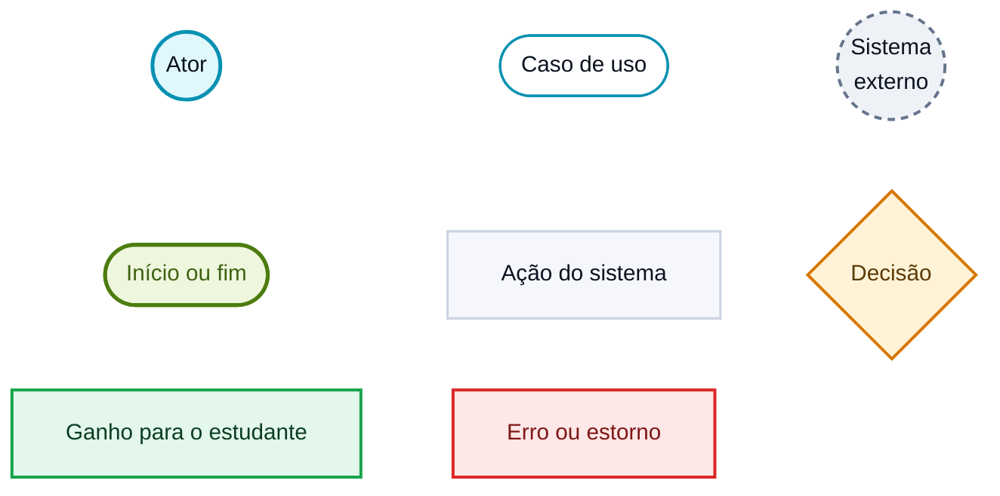

# Identidade visual dos diagramas

> **Vértice** — Plataforma de Acompanhamento de Aprendizagem
> Entrega 2 · Modelagem do Software · Equipe 7

---

Os diagramas deste repositório usam o mesmo sistema de cores e a mesma tipografia da aplicação, definidos em `src/styles/theme.js`. A intenção é que documento, modelos e telas sejam lidos como o mesmo produto, e não como artefatos produzidos em ferramentas diferentes.

---

## Paleta

| Papel | Cor | Onde aparece nos diagramas |
|---|---|---|
| Ciano — marca e ações principais | `#0891B2` | Atores, casos de uso e entidades do núcleo do domínio |
| Verde limão — acento da marca | `#4D7C0F` | Início e fim dos fluxos, classe associativa |
| Âmbar — status "fazendo" e alerta | `#D97706` | Losangos de decisão e avisos |
| Verde — status "concluído" | `#16A34A` | Passos que geram ganho para o estudante: experiência, conquista, progresso |
| Rosa — perigo | `#DC2626` | Erros de validação e estorno de experiência |
| Cinza-azulado — neutro | `#64748B` | Sistemas externos, enumerações e ações sem efeito no progresso |

As cores são as da paleta `coresClaras` do arquivo de tema, escolhida por atravessar bem os três meios em que os diagramas serão vistos: o documento entregue, a impressão e a leitura no GitHub. Nenhuma cor foi inventada para os diagramas.

---

## Tipografia

| Uso | Fonte |
|---|---|
| Rótulos de nós, entidades e classes | **Space Grotesk** — a mesma do corpo de texto da aplicação |
| Rótulos de transição e de relacionamento | **Space Mono** — a mesma dos rótulos de dados da interface |

---

## Vocabulário de formas

| Forma | Significado |
|---|---|
| Círculo ciano preenchido | Ator do sistema — quem inicia a interação |
| Círculo cinza tracejado | Sistema externo — participa, mas não inicia nada |
| Pílula com borda ciano | Caso de uso |
| Pílula verde limão | Início e fim de um fluxo |
| Retângulo neutro | Ação executada pelo usuário ou pelo sistema |
| Losango âmbar | Ponto de decisão, sempre com as saídas rotuladas |
| Retângulo verde | Passo que devolve ganho ao estudante |
| Retângulo rosa | Erro de validação ou estorno |

---

## Como os diagramas são mantidos

Os arquivos `.md` deste repositório trazem o código-fonte dos diagramas em Mermaid, já com o tema aplicado. O GitHub os renderiza automaticamente, e qualquer alteração é feita no texto, sem depender de ferramenta de desenho. As imagens em `diagramas/png/` são a exportação desses mesmos arquivos, para inserir no documento entregue.

---

### Navegação

[Índice](../README.md) · [Próximo: Casos de Uso ➡](01-casos-de-uso.md)
