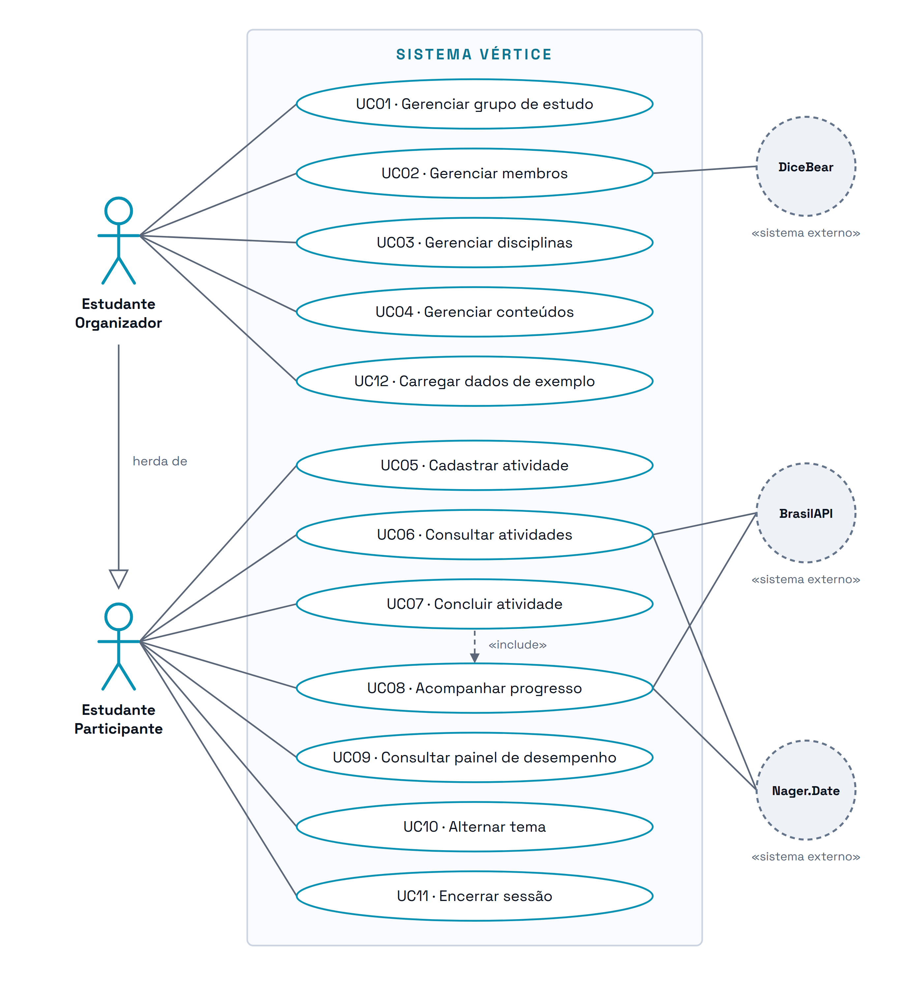

# Diagrama de Casos de Uso

> **Vértice** — Plataforma de Acompanhamento de Aprendizagem
> Entrega 2 · Modelagem do Software · Equipe 7

---

O diagrama apresenta os atores do sistema e as funcionalidades que cada um utiliza. O retângulo delimita a fronteira do Vértice: o que está dentro é responsabilidade do sistema, o que está fora são os atores.

O **Estudante Organizador** herda todas as funcionalidades do **Estudante Participante** e acrescenta a gestão da estrutura do grupo.

Os três círculos tracejados à direita são **atores secundários**: nenhum deles inicia funcionalidade alguma, apenas respondem quando o sistema os consulta. O boneco palito fica reservado ao ator que é pessoa; serviço de software aparece como círculo, com o estereótipo «sistema externo». A **BrasilAPI** fornece os feriados nacionais e a **Nager.Date** é a fonte reserva, acionada quando a primeira falha ou demora (RN17). A **DiceBear** gera as imagens de avatar a partir da semente gravada no cadastro do membro (RF19, RN15).

A DiceBear aparece ligada apenas ao UC02 porque é ali que o avatar é escolhido, e a escolha faz parte do objetivo do caso de uso. Nas demais telas a imagem só é exibida, e ligar o ator a todas elas encheria o diagrama sem acrescentar informação.

> Desenho-fonte: [`svg/casos-de-uso.svg`](svg/casos-de-uso.svg) · Imagem para o documento: [`png/casos-de-uso.png`](png/casos-de-uso.png)

Este é o único diagrama do repositório desenhado em SVG e não em Mermaid. O Mermaid não possui a forma de ator da UML — o boneco palito —, e usar a mesma forma para a pessoa e para o serviço externo apagaria justamente a distinção que o diagrama precisa mostrar. O SVG é texto, fica versionado como os demais e usa a mesma paleta e a mesma tipografia dos outros diagramas, descritas na [identidade visual](00-identidade-visual.md).

---

## Correspondência entre casos de uso e requisitos

| Caso de uso | Requisitos atendidos | Ator principal |
|---|---|---|
| UC01 · Gerenciar grupo de estudo | RF01 | Estudante Organizador |
| UC02 · Gerenciar membros | RF02, RF19 | Estudante Organizador |
| UC03 · Gerenciar disciplinas | RF13 | Estudante Organizador |
| UC04 · Gerenciar conteúdos | RF14 | Estudante Organizador |
| UC12 · Carregar dados de exemplo | RF20 | Estudante Organizador |
| UC05 · Cadastrar atividade | RF03 | Estudante Participante |
| UC06 · Consultar atividades | RF04, RF05, RF07, RF22 | Estudante Participante |
| UC07 · Concluir atividade | RF05, RF15, RF16, RF17 | Estudante Participante |
| UC08 · Acompanhar progresso | RF06, RF07, RF10, RF11, RF12, RF21, RF22 | Estudante Participante |
| UC09 · Consultar painel de desempenho | RF18 | Estudante Participante |
| UC10 · Alternar tema | RF08 | Estudante Participante |
| UC11 · Encerrar sessão | RF09 | Estudante Participante |

Todos os vinte e dois requisitos funcionais aparecem em pelo menos um caso de uso.

| Ator secundário | Casos de uso | Requisito |
|---|---|---|
| BrasilAPI | UC06, UC08 | RF07, RF21 |
| Nager.Date | UC06, UC08 | RF07, RF21 |
| DiceBear | UC02 | RF19 |

---

### Navegação

[Índice](../README.md) · [Especificação dos casos de uso](../docs/10-casos-de-uso.md) · [Próximo diagrama: Classes ➡](02-classes.md)
