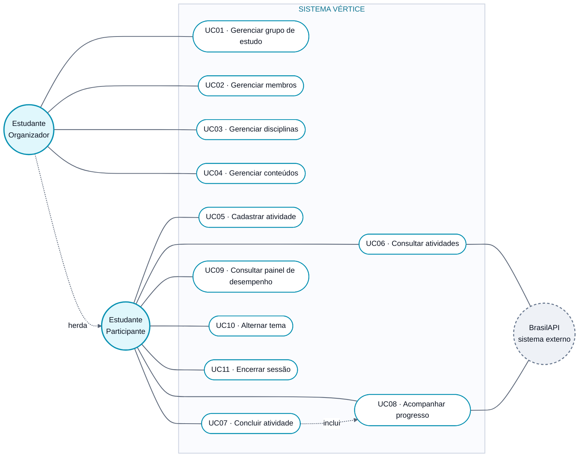

# Diagrama de Casos de Uso

> **Vértice** — Plataforma de Acompanhamento de Aprendizagem
> Entrega 2 · Modelagem do Software · Equipe 7

---

O diagrama apresenta os atores do sistema e as funcionalidades que cada um utiliza. O retângulo delimita a fronteira do Vértice: o que está dentro é responsabilidade do sistema, o que está fora são os atores.

O **Estudante Organizador** herda todas as funcionalidades do **Estudante Participante** e acrescenta a gestão da estrutura do grupo. A **BrasilAPI** é um ator secundário: não inicia nenhuma funcionalidade, apenas fornece a lista de feriados nacionais quando o sistema a consulta.

> Versão em imagem para inserir no documento: [`png/casos-de-uso.png`](png/casos-de-uso.png)

---

## Correspondência entre casos de uso e requisitos

| Caso de uso | Requisitos atendidos | Ator principal |
|---|---|---|
| UC01 · Gerenciar grupo de estudo | RF01 | Estudante Organizador |
| UC02 · Gerenciar membros | RF02 | Estudante Organizador |
| UC03 · Gerenciar disciplinas | RF13 | Estudante Organizador |
| UC04 · Gerenciar conteúdos | RF14 | Estudante Organizador |
| UC05 · Cadastrar atividade | RF03 | Estudante Participante |
| UC06 · Consultar atividades | RF04, RF05, RF07 | Estudante Participante |
| UC07 · Concluir atividade | RF05, RF15, RF16, RF17 | Estudante Participante |
| UC08 · Acompanhar progresso | RF06, RF07, RF10, RF11, RF12 | Estudante Participante |
| UC09 · Consultar painel de desempenho | RF18 | Estudante Participante |
| UC10 · Alternar tema | RF08 | Estudante Participante |
| UC11 · Encerrar sessão | RF09 | Estudante Participante |

Todos os dezoito requisitos funcionais aparecem em pelo menos um caso de uso.

---

### Navegação

[Índice](../README.md) · [Especificação dos casos de uso](../docs/10-casos-de-uso.md) · [Próximo diagrama: Classes ➡](02-classes.md)
