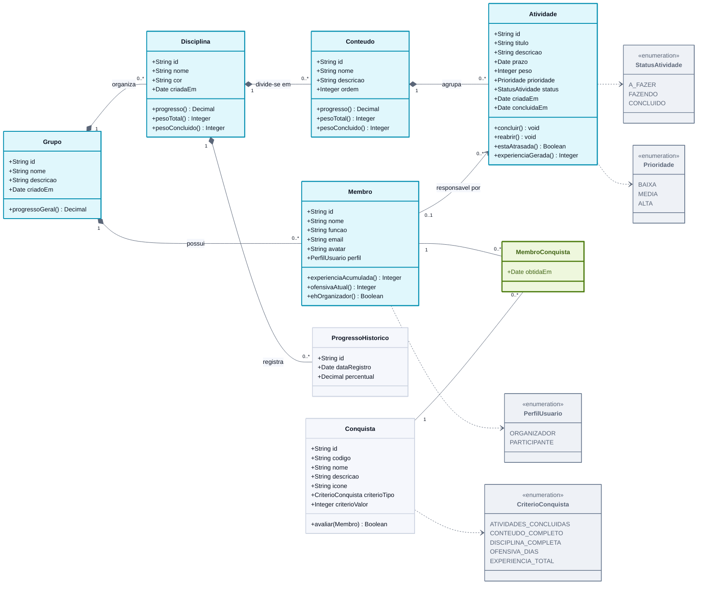

# Diagrama de Classes

> **Vértice** — Plataforma de Acompanhamento de Aprendizagem
> Entrega 2 · Modelagem do Software · Equipe 7

---

O diagrama apresenta as oito classes do domínio, seus atributos principais e os relacionamentos com cardinalidade. Os losangos preenchidos indicam **composição**: a existência da parte depende do todo, o que corresponde à cascata de exclusão descrita na RN02.

> Versão em imagem para inserir no documento: [`png/diagrama-de-classes.png`](png/diagrama-de-classes.png)

---

## Leitura dos relacionamentos

| Relacionamento | Cardinalidade | Leitura |
|---|---|---|
| Grupo — Membro | 1 : 0..N | Um grupo possui vários membros; cada membro pertence a exatamente um grupo |
| Grupo — Disciplina | 1 : 0..N | Um grupo organiza várias disciplinas; cada disciplina pertence a um único grupo |
| Disciplina — Conteúdo | 1 : 0..N | Uma disciplina divide-se em vários conteúdos; cada conteúdo pertence a uma única disciplina (RN13) |
| Conteúdo — Atividade | 1 : 0..N | Um conteúdo agrupa várias atividades; cada atividade pertence a exatamente um conteúdo (RN13) |
| Membro — Atividade | 0..1 : 0..N | Um membro pode ser responsável por várias atividades; uma atividade tem no máximo um responsável e pode ficar sem nenhum (RN02) |
| Disciplina — ProgressoHistorico | 1 : 0..N | Uma disciplina acumula vários registros de progresso ao longo do tempo (RF12) |
| Membro — Conquista | 0..N : 0..N | Um membro obtém várias conquistas e uma conquista é obtida por vários membros. A associação é resolvida pela classe associativa **MembroConquista**, que guarda a data de obtenção (RN12) |

---

## Observações de projeto

**Experiência e ofensiva são calculadas, não armazenadas.** `Membro.experienciaAcumulada()` soma `Atividade.experienciaGerada()` das atividades concluídas sob sua responsabilidade, e `Membro.ofensivaAtual()` percorre as datas em `Atividade.concluidaEm`. Guardar esses valores em atributos criaria uma segunda fonte de verdade que precisaria ser sincronizada a cada alteração de status, inclusive nas reversões previstas na RN10.

**O progresso também é calculado.** `Conteudo.progresso()` e `Disciplina.progresso()` aplicam diretamente as fórmulas da RN08 e da RN14. A classe **ProgressoHistorico** não duplica esse cálculo: ela guarda o resultado de um dia específico, porque a evolução ao longo do tempo (RF12) não pode ser reconstruída a partir do estado atual.

**A Conquista é um catálogo.** Ela não pertence a nenhum grupo: descreve o marco e o critério de avaliação. Quem liga o marco ao estudante é a classe associativa MembroConquista.

---

### Navegação

[⬅ Anterior: Casos de Uso](01-casos-de-uso.md) · [Índice](../README.md) · [Próximo: Fluxo — Concluir Atividade ➡](03-atividade-concluir.md)
