# Diagrama de Atividades — Concluir atividade e recalcular progresso

> **Vértice** — Plataforma de Acompanhamento de Aprendizagem
> Entrega 2 · Modelagem do Software · Equipe 7

---

Este é o processo central do sistema: é nele que a execução de uma atividade se transforma em medida de aprendizagem. Corresponde ao [UC07 · Concluir atividade](../docs/10-casos-de-uso.md#uc07--concluir-atividade) e aos requisitos RF05, RF15, RF16 e RF17.

```mermaid
%%{init: {"theme": "base", "fontFamily": "Space Grotesk", "themeVariables": {"fontFamily": "Space Grotesk, Segoe UI, sans-serif", "fontSize": "15px", "primaryColor": "#F5F7FC", "primaryTextColor": "#0B1220", "primaryBorderColor": "#CDD4E1", "lineColor": "#5B6678", "secondaryColor": "#EEF7DD", "tertiaryColor": "#FAFBFE", "clusterBkg": "#FAFBFE", "clusterBorder": "#CDD4E1", "edgeLabelBackground": "#FFFFFF", "titleColor": "#0E7490", "nodeBorder": "#CDD4E1", "mainBkg": "#F5F7FC", "textColor": "#0B1220"}, "flowchart": {"curve": "basis", "padding": 18, "nodeSpacing": 48, "rankSpacing": 58}}}%%
flowchart TD
    INI([Início]) --> A1[Estudante abre a atividade]
    A1 --> A2[Estudante seleciona o status Concluído]
    A2 --> A3[Sistema grava o status e a data de conclusão]

    A3 --> D1{Atividade tem<br/>responsável?}

    D1 -- Não --> A7
    D1 -- Sim --> A4[Sistema credita experiência<br/>igual ao peso vezes 10]

    A4 --> A5[Sistema recalcula a ofensiva<br/>do responsável]
    A5 --> A6[Sistema avalia os marcos<br/>de conquista do responsável]

    A6 --> D2{Algum marco<br/>foi atingido?}
    D2 -- Sim --> A61[Sistema concede a conquista<br/>e registra a data de obtenção]
    D2 -- Não --> A7
    A61 --> A7

    A7[Sistema recalcula o progresso do conteúdo<br/>peso concluído dividido pelo peso total]
    A7 --> A8[Sistema recalcula o progresso da disciplina]
    A8 --> A9[Sistema registra o percentual do dia<br/>no histórico de progresso]
    A9 --> A10[Sistema exibe barra de progresso atualizada,<br/>experiência creditada e conquistas obtidas]
    A10 --> FIM([Fim])

    classDef ator fill:#E0F7FC,stroke:#0891B2,stroke-width:2.5px,color:#0B1220
    classDef externo fill:#EEF1F6,stroke:#64748B,stroke-width:2px,color:#0B1220,stroke-dasharray:5 4
    classDef uc fill:#FFFFFF,stroke:#0891B2,stroke-width:1.6px,color:#0B1220
    classDef terminal fill:#EEF7DD,stroke:#4D7C0F,stroke-width:2.5px,color:#3F6212
    classDef acao fill:#F5F7FC,stroke:#CDD4E1,stroke-width:1.6px,color:#0B1220
    classDef decisao fill:#FEF3D7,stroke:#D97706,stroke-width:2px,color:#5C3A05
    classDef ganho fill:#E3F7EC,stroke:#16A34A,stroke-width:2px,color:#0B3D21
    classDef erro fill:#FDE7E7,stroke:#DC2626,stroke-width:2px,color:#7F1616
    class INI,FIM terminal
    class D1,D2 decisao
    class A1,A2,A3,A5,A7,A8,A9 acao
    class A4,A61,A10 ganho
    linkStyle default stroke:#5B6678,stroke-width:1.6px

    classDef ator fill:#E0F7FC,stroke:#0891B2,stroke-width:2.5px,color:#0B1220
    classDef externo fill:#EEF1F6,stroke:#64748B,stroke-width:2px,color:#0B1220,stroke-dasharray:5 4
    classDef uc fill:#FFFFFF,stroke:#0891B2,stroke-width:1.6px,color:#0B1220
    classDef terminal fill:#EEF7DD,stroke:#4D7C0F,stroke-width:2.5px,color:#3F6212
    classDef acao fill:#F5F7FC,stroke:#CDD4E1,stroke-width:1.6px,color:#0B1220
    classDef decisao fill:#FEF3D7,stroke:#D97706,stroke-width:2px,color:#5C3A05
    classDef ganho fill:#E3F7EC,stroke:#16A34A,stroke-width:2px,color:#0B3D21
    classDef erro fill:#FDE7E7,stroke:#DC2626,stroke-width:2px,color:#7F1616
    class INI,FIM terminal
    class D1,D2 decisao
    class A1,A2,A3,A5,A7,A8,A9 acao
    class A4,A61,A10 ganho
    linkStyle default stroke:#5B6678,stroke-width:1.6px
```

> Versão em imagem para inserir no documento: [`png/fluxo-concluir-atividade.png`](png/fluxo-concluir-atividade.png)

---

## Fluxo de reversão

A RN10 prevê que a experiência seja estornada quando a atividade deixa de estar concluída, mas a RN12 determina que a conquista já concedida **não** seja revogada. O diagrama abaixo detalha esse caminho.

```mermaid
%%{init: {"theme": "base", "fontFamily": "Space Grotesk", "themeVariables": {"fontFamily": "Space Grotesk, Segoe UI, sans-serif", "fontSize": "15px", "primaryColor": "#F5F7FC", "primaryTextColor": "#0B1220", "primaryBorderColor": "#CDD4E1", "lineColor": "#5B6678", "secondaryColor": "#EEF7DD", "tertiaryColor": "#FAFBFE", "clusterBkg": "#FAFBFE", "clusterBorder": "#CDD4E1", "edgeLabelBackground": "#FFFFFF", "titleColor": "#0E7490", "nodeBorder": "#CDD4E1", "mainBkg": "#F5F7FC", "textColor": "#0B1220"}, "flowchart": {"curve": "basis", "padding": 18, "nodeSpacing": 48, "rankSpacing": 58}}}%%
flowchart TD
    INI([Início]) --> B1[Estudante altera o status de Concluído<br/>para A fazer ou Fazendo]
    B1 --> B2[Sistema grava o novo status<br/>e limpa a data de conclusão]
    B2 --> D1{Atividade tinha<br/>responsável?}
    D1 -- Sim --> B3[Sistema estorna a experiência<br/>creditada por esta atividade]
    B3 --> B4[Sistema recalcula a ofensiva<br/>do responsável]
    D1 -- Não --> B5
    B4 --> B5[Sistema recalcula o progresso<br/>do conteúdo e da disciplina]
    B5 --> B6[Conquistas já concedidas<br/>permanecem inalteradas]
    B6 --> B7[Sistema registra o percentual do dia<br/>no histórico de progresso]
    B7 --> FIM([Fim])

    classDef ator fill:#E0F7FC,stroke:#0891B2,stroke-width:2.5px,color:#0B1220
    classDef externo fill:#EEF1F6,stroke:#64748B,stroke-width:2px,color:#0B1220,stroke-dasharray:5 4
    classDef uc fill:#FFFFFF,stroke:#0891B2,stroke-width:1.6px,color:#0B1220
    classDef terminal fill:#EEF7DD,stroke:#4D7C0F,stroke-width:2.5px,color:#3F6212
    classDef acao fill:#F5F7FC,stroke:#CDD4E1,stroke-width:1.6px,color:#0B1220
    classDef decisao fill:#FEF3D7,stroke:#D97706,stroke-width:2px,color:#5C3A05
    classDef ganho fill:#E3F7EC,stroke:#16A34A,stroke-width:2px,color:#0B3D21
    classDef erro fill:#FDE7E7,stroke:#DC2626,stroke-width:2px,color:#7F1616
    class INI,FIM terminal
    class D1 decisao
    class B1,B2,B4,B5,B7 acao
    class B3 erro
    class B6 ganho
    linkStyle default stroke:#5B6678,stroke-width:1.6px

    classDef ator fill:#E0F7FC,stroke:#0891B2,stroke-width:2.5px,color:#0B1220
    classDef externo fill:#EEF1F6,stroke:#64748B,stroke-width:2px,color:#0B1220,stroke-dasharray:5 4
    classDef uc fill:#FFFFFF,stroke:#0891B2,stroke-width:1.6px,color:#0B1220
    classDef terminal fill:#EEF7DD,stroke:#4D7C0F,stroke-width:2.5px,color:#3F6212
    classDef acao fill:#F5F7FC,stroke:#CDD4E1,stroke-width:1.6px,color:#0B1220
    classDef decisao fill:#FEF3D7,stroke:#D97706,stroke-width:2px,color:#5C3A05
    classDef ganho fill:#E3F7EC,stroke:#16A34A,stroke-width:2px,color:#0B3D21
    classDef erro fill:#FDE7E7,stroke:#DC2626,stroke-width:2px,color:#7F1616
    class INI,FIM terminal
    class D1 decisao
    class B1,B2,B4,B5,B7 acao
    class B3 erro
    class B6 ganho
    linkStyle default stroke:#5B6678,stroke-width:1.6px
```

> Versão em imagem para inserir no documento: [`png/fluxo-reverter-conclusao.png`](png/fluxo-reverter-conclusao.png)

---

## Decisões representadas

| Decisão | Origem | Consequência |
|---|---|---|
| Atividade tem responsável? | RN10 | Sem responsável, não há a quem creditar experiência, calcular ofensiva ou conceder conquista. O progresso do conteúdo é recalculado de qualquer forma, porque depende do peso e não da pessoa |
| Algum marco foi atingido? | RN12 | A conquista é concedida uma única vez, no instante em que a condição passa a ser satisfeita |
| Atividade tinha responsável? (reversão) | RN10 | O estorno só se aplica a quem recebeu o crédito |

---

### Navegação

[⬅ Anterior: Classes](02-classes.md) · [Índice](../README.md) · [Próximo: Fluxo — Cadastrar Atividade ➡](04-atividade-cadastrar.md)
