# Diagrama de Atividades — Cadastrar atividade vinculada a disciplina e conteúdo

> **Vértice** — Plataforma de Acompanhamento de Aprendizagem
> Entrega 2 · Modelagem do Software · Equipe 7

---

Segundo processo central: é o cadastro que ancora a atividade na estrutura de aprendizagem. Corresponde ao [UC05 · Cadastrar atividade](../docs/10-casos-de-uso.md#uc05--cadastrar-atividade) e ao requisito RF03, aplicando as regras RN03, RN04, RN06, RN09 e RN13.

```mermaid
%%{init: {"theme": "base", "fontFamily": "Space Grotesk", "themeVariables": {"fontFamily": "Space Grotesk, Segoe UI, sans-serif", "fontSize": "15px", "primaryColor": "#F5F7FC", "primaryTextColor": "#0B1220", "primaryBorderColor": "#CDD4E1", "lineColor": "#5B6678", "secondaryColor": "#EEF7DD", "tertiaryColor": "#FAFBFE", "clusterBkg": "#FAFBFE", "clusterBorder": "#CDD4E1", "edgeLabelBackground": "#FFFFFF", "titleColor": "#0E7490", "nodeBorder": "#CDD4E1", "mainBkg": "#F5F7FC", "textColor": "#0B1220"}, "flowchart": {"curve": "basis", "padding": 18, "nodeSpacing": 48, "rankSpacing": 58}}}%%
flowchart TD
    INI([Início]) --> C1[Estudante aciona Nova atividade]
    C1 --> D0{Existe conteúdo<br/>cadastrado no grupo?}

    D0 -- Não --> C2[Sistema informa a necessidade de cadastrar<br/>disciplina e conteúdo antes]
    C2 --> C3[Organizador cadastra a disciplina]
    C3 --> C4[Organizador cadastra o conteúdo<br/>vinculado à disciplina]
    C4 --> C5

    D0 -- Sim --> C5[Sistema exibe o formulário da atividade]
    C5 --> C6[Estudante seleciona a disciplina]
    C6 --> C7[Sistema filtra os conteúdos<br/>apenas os da disciplina escolhida]
    C7 --> C8[Estudante preenche título, descrição, conteúdo,<br/>prazo, peso, prioridade, status e responsável]
    C8 --> C9[Estudante confirma]

    C9 --> D1{Título com 3 ou mais caracteres,<br/>prazo válido e conteúdo selecionado?}
    D1 -- Não --> C10[Sistema destaca cada campo inválido<br/>com mensagem específica]
    C10 --> C8

    D1 -- Sim --> C11[Sistema aplica os padrões:<br/>status A fazer e peso 1 quando não informados]
    C11 --> D2{Prazo coincide com<br/>feriado nacional?}
    D2 -- Sim --> C12[Sistema exibe aviso do feriado<br/>sem impedir o cadastro]
    D2 -- Não --> C13
    C12 --> C13[Sistema grava a atividade<br/>e registra a data de criação]

    C13 --> C14[Sistema soma o peso da atividade<br/>ao peso total do conteúdo]
    C14 --> C15[Sistema atualiza a listagem<br/>e o progresso do conteúdo e da disciplina]
    C15 --> FIM([Fim])

    classDef ator fill:#E0F7FC,stroke:#0891B2,stroke-width:2.5px,color:#0B1220
    classDef externo fill:#EEF1F6,stroke:#64748B,stroke-width:2px,color:#0B1220,stroke-dasharray:5 4
    classDef uc fill:#FFFFFF,stroke:#0891B2,stroke-width:1.6px,color:#0B1220
    classDef terminal fill:#EEF7DD,stroke:#4D7C0F,stroke-width:2.5px,color:#3F6212
    classDef acao fill:#F5F7FC,stroke:#CDD4E1,stroke-width:1.6px,color:#0B1220
    classDef decisao fill:#FEF3D7,stroke:#D97706,stroke-width:2px,color:#5C3A05
    classDef ganho fill:#E3F7EC,stroke:#16A34A,stroke-width:2px,color:#0B3D21
    classDef erro fill:#FDE7E7,stroke:#DC2626,stroke-width:2px,color:#7F1616
    class INI,FIM terminal
    class D0,D1,D2 decisao
    class C1,C2,C3,C4,C5,C6,C7,C8,C9,C11,C13 acao
    class C10 erro
    class C12 decisao
    class C14,C15 ganho
    linkStyle default stroke:#5B6678,stroke-width:1.6px

    classDef ator fill:#E0F7FC,stroke:#0891B2,stroke-width:2.5px,color:#0B1220
    classDef externo fill:#EEF1F6,stroke:#64748B,stroke-width:2px,color:#0B1220,stroke-dasharray:5 4
    classDef uc fill:#FFFFFF,stroke:#0891B2,stroke-width:1.6px,color:#0B1220
    classDef terminal fill:#EEF7DD,stroke:#4D7C0F,stroke-width:2.5px,color:#3F6212
    classDef acao fill:#F5F7FC,stroke:#CDD4E1,stroke-width:1.6px,color:#0B1220
    classDef decisao fill:#FEF3D7,stroke:#D97706,stroke-width:2px,color:#5C3A05
    classDef ganho fill:#E3F7EC,stroke:#16A34A,stroke-width:2px,color:#0B3D21
    classDef erro fill:#FDE7E7,stroke:#DC2626,stroke-width:2px,color:#7F1616
    class INI,FIM terminal
    class D0,D1,D2 decisao
    class C1,C2,C3,C4,C5,C6,C7,C8,C9,C11,C13 acao
    class C10 erro
    class C12 decisao
    class C14,C15 ganho
    linkStyle default stroke:#5B6678,stroke-width:1.6px
```

> Versão em imagem para inserir no documento: [`png/fluxo-cadastrar-atividade.png`](png/fluxo-cadastrar-atividade.png)

---

## Decisões representadas

| Decisão | Origem | Consequência |
|---|---|---|
| Existe conteúdo cadastrado no grupo? | RN13 | Toda atividade precisa de um conteúdo. Sem estrutura cadastrada, o fluxo desvia para o cadastro de disciplina e conteúdo antes de prosseguir |
| Título, prazo e conteúdo válidos? | RN06, RN13, RNF03 | O sistema não grava dados incompletos e devolve a mensagem no próprio campo, preservando o que já foi digitado |
| Prazo coincide com feriado nacional? | RF07 | O feriado é um aviso, não um impedimento. A atividade é gravada normalmente |

---

## Observação sobre o peso

O passo "soma o peso da atividade ao peso total do conteúdo" não corresponde a um campo gravado: o peso total é obtido pela soma dos pesos das atividades do conteúdo no momento do cálculo (RN08). O passo está no diagrama porque representa o efeito visível para o usuário — o percentual de progresso do conteúdo cai quando uma atividade nova é adicionada, já que o denominador aumenta.

---

### Navegação

[⬅ Anterior: Fluxo — Concluir Atividade](03-atividade-concluir.md) · [Índice](../README.md) · [Próximo: Modelo Conceitual ➡](../banco-de-dados/01-modelo-conceitual.md)
