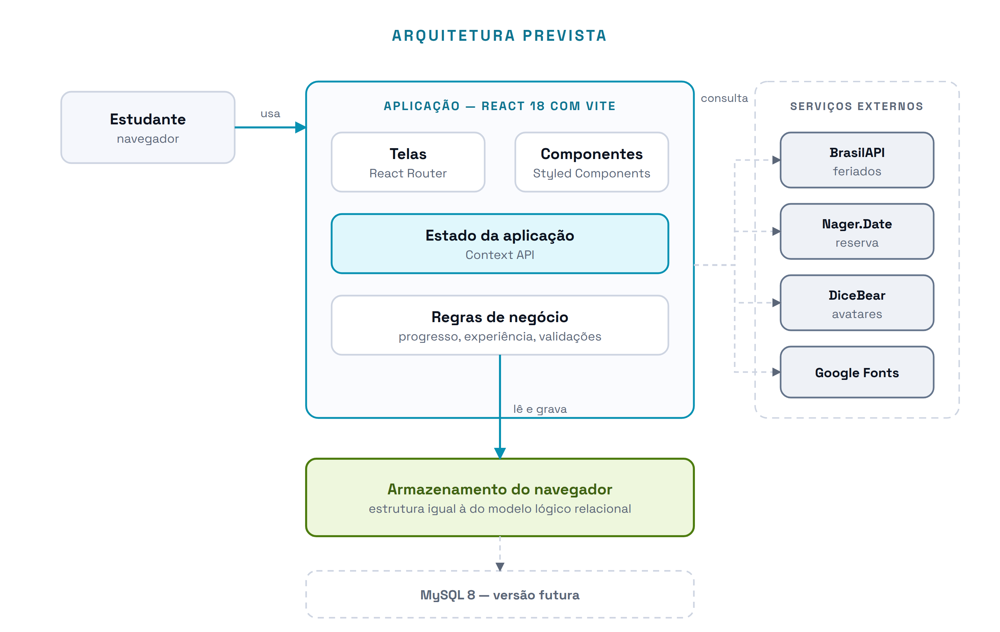

# 13 · Arquitetura e Tecnologias

> **Vértice** — Plataforma de Acompanhamento de Aprendizagem
> Documento de Visão e Requisitos · Imersão Profissional: Projeto de Software · ADSIS4S · Entrega 3

---

O Vértice é uma aplicação web que roda inteiramente no navegador. Não há servidor de aplicação próprio: as regras de negócio e a persistência acontecem no mesmo lugar em que a interface é desenhada. A escolha é deliberada e está registrada como restrição no [Escopo](05-escopo.md).

---

> Desenho-fonte: [`../diagramas/svg/arquitetura.svg`](../diagramas/svg/arquitetura.svg)

O desenho tem três blocos e uma direção. À esquerda o estudante, no meio a aplicação, embaixo a persistência. À direita, fora da fronteira, os serviços que a aplicação consulta mas que não guardam nada do grupo. A caixa tracejada na base é o banco relacional já modelado na Entrega 2, previsto para a versão seguinte.

---

## Camadas

| Camada | Tecnologia escolhida | Justificativa |
|---|---|---|
| **Interface** | React 18 com Vite | Stack que a equipe já domina. O Vite dá servidor de desenvolvimento rápido e build de produção com configuração mínima, o que importa num prazo de bimestre |
| **Roteamento** | React Router | Rotas públicas e privadas sem biblioteca adicional. A rota privada é o que separa "fora da sessão" de "dentro da sessão" no mapa de navegação |
| **Estilo** | Styled Components | Permite manter os tokens do design system, tema claro e escuro, no mesmo arquivo do componente. Sem folha de estilo global concorrendo com o componente |
| **Estado** | Context API | Suficiente para o volume de dados de um grupo de estudo. Uma biblioteca de estado externa resolveria um problema que o projeto não tem |
| **Persistência** | Armazenamento do navegador | Elimina a necessidade de servidor dentro do prazo. A estrutura gravada é a mesma do modelo lógico relacional, então a migração exige trocar a camada de acesso, não remodelar os dados |
| **Servidor** | Não há nesta versão | Sem servidor não há autenticação por senha, e por isso o acesso é pela seleção do grupo. Está registrado como restrição |
| **Hospedagem** | Não se aplica nesta versão | A aplicação roda localmente. Publicação em serviço estático fica para quando houver banco real |

---

## Serviços externos

Quatro serviços de terceiros, todos gratuitos e sem contrato de nível de serviço. Cada um tem alternativa local prevista, porque nenhum deles pode derrubar a tela (RNF10).

| Serviço | Para quê | Se ficar indisponível |
|---|---|---|
| **BrasilAPI** | Feriados nacionais | O sistema consulta a fonte reserva (RN17) |
| **Nager.Date** | Fonte reserva dos feriados | O sistema reutiliza a última relação obtida; não havendo nenhuma, omite a sinalização e avisa |
| **DiceBear** | Imagem do avatar, gerada a partir da semente gravada em `membro.avatar` | O sistema exibe as iniciais do nome (RN15) |
| **Google Fonts** | Famílias Space Grotesk e Space Mono | O navegador recai na fonte sem serifa do sistema; só a tipografia muda |

Nenhum deles recebe dado do grupo. A comunicação é de mão única: o sistema pede, o serviço responde. Isso é o que os torna atores secundários no [diagrama de casos de uso](../diagramas/01-casos-de-uso.md) e não participantes do domínio.

---

## Onde ficam as regras de negócio

As regras não estão espalhadas pelas telas. Ficam em módulos próprios, consumidos por quem precisar:

| Regra | Onde vive | Requisito |
|---|---|---|
| Cálculo do progresso de conteúdo e de disciplina | Módulo de progresso | RN08, RN14 |
| Crédito e estorno de experiência | Módulo de gamificação | RN10 |
| Validação de título, prazo, peso e vínculos | Módulo de validação | RN06, RN09, RN13 |
| Classificação de atraso e urgência do prazo | Módulo de datas | RN05, RN16 |
| Cadeia de obtenção dos feriados | Módulo de feriados | RN17 |

Concentrar o cálculo fora da tela é o que permite que a mesma regra alimente o painel, a tela de disciplinas e o detalhe da atividade sem ser reescrita três vezes — e é o que torna a migração para banco real uma troca de camada, e não uma reescrita.

---

## O caminho até o banco relacional

A modelagem relacional da Entrega 2 não é um exercício paralelo à implementação. O armazenamento do navegador guarda os mesmos oito conjuntos de dados, com as mesmas chaves e os mesmos vínculos do modelo lógico. A diferença está em onde eles moram, não em como se relacionam.

| O que muda na migração | O que não muda |
|---|---|
| A camada de acesso aos dados passa a falar SQL | O modelo conceitual, o modelo lógico e o dicionário de dados |
| Passa a existir um servidor entre a tela e os dados | As regras de negócio e os cálculos de progresso |
| Passa a ser possível autenticar por senha e compartilhar entre dispositivos | As telas e o mapa de navegação |

---

### Navegação

[⬅ Anterior: Backlog](12-backlog.md) · [Índice](../README.md) · [Próximo: Produto Mínimo Viável ➡](14-mvp.md)
