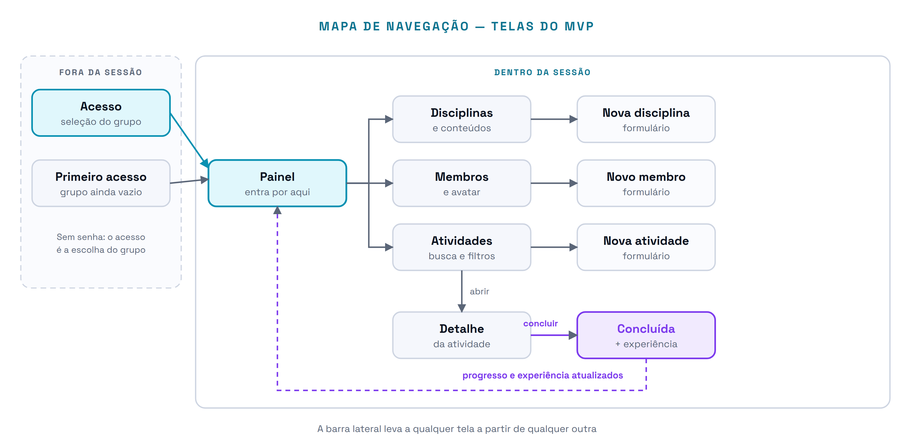
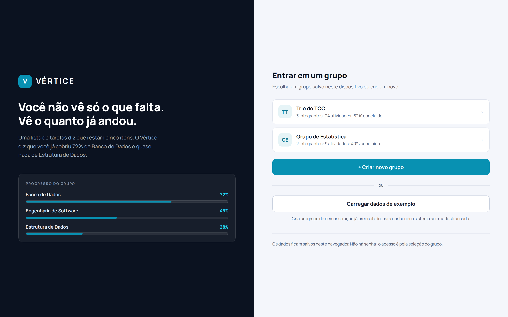
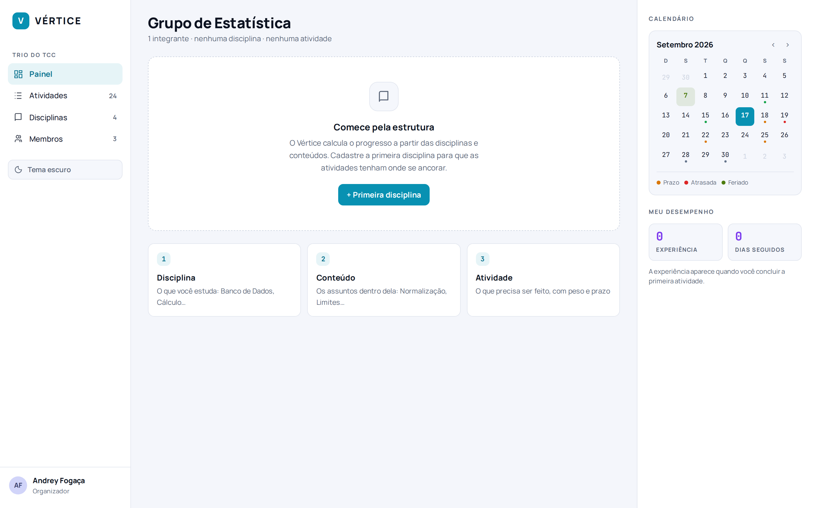
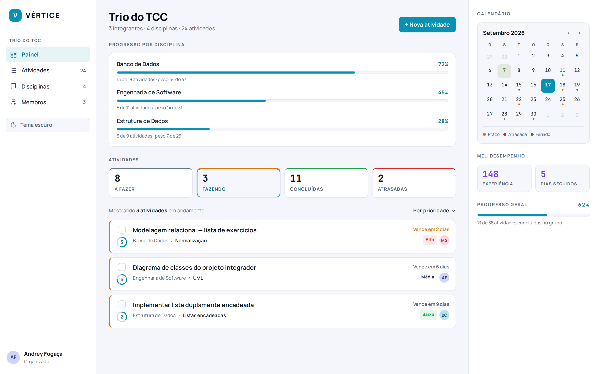
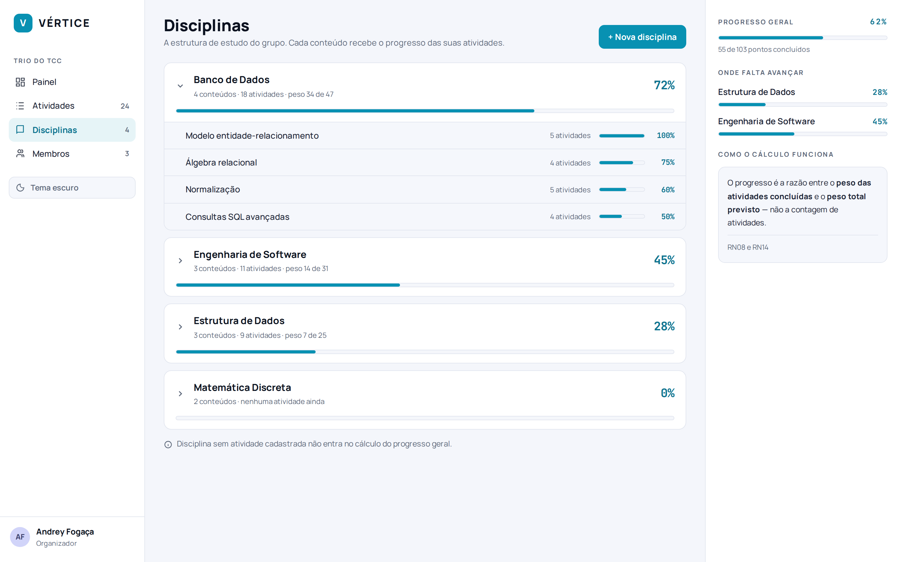
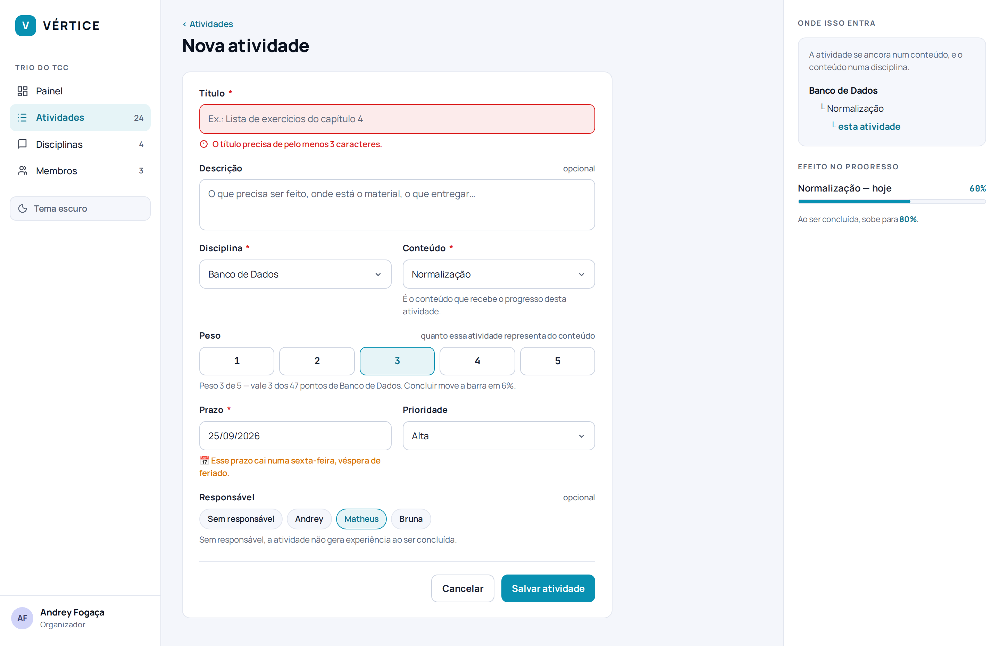
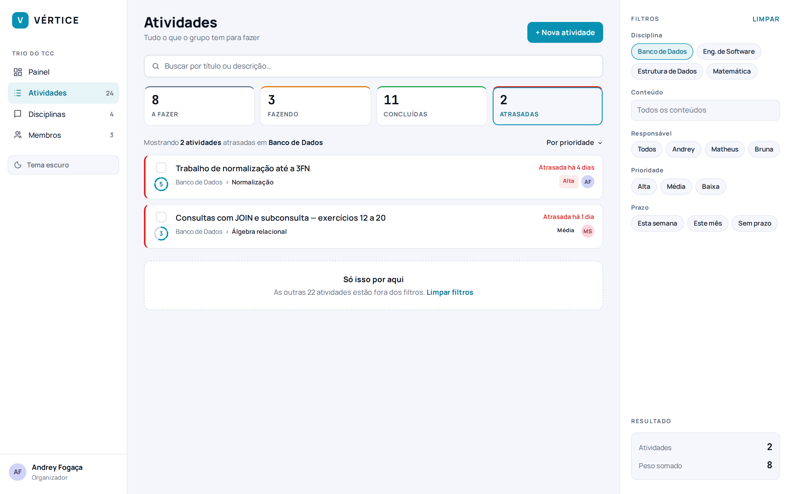
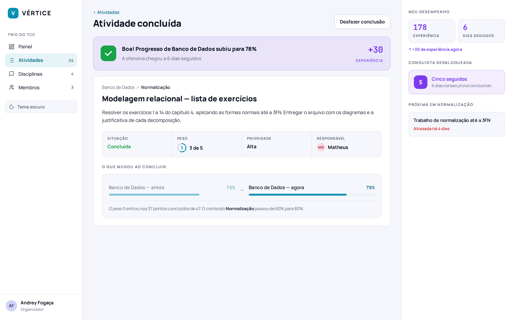
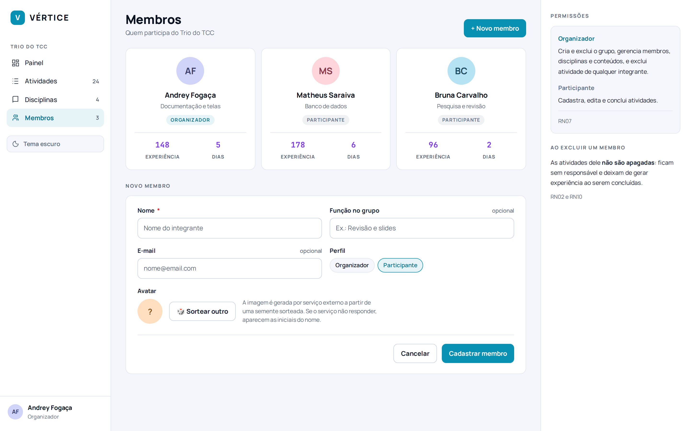
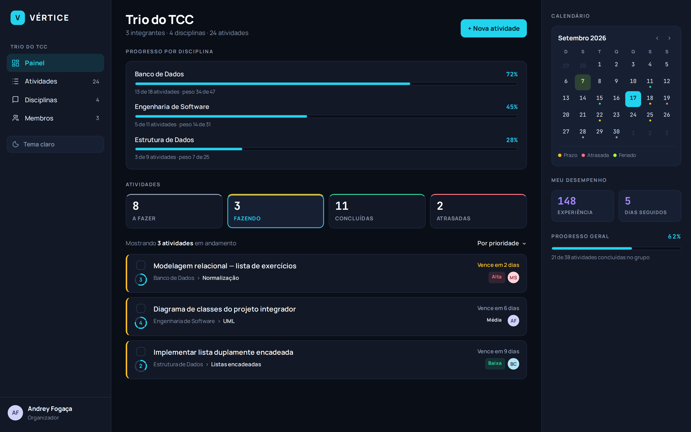

# Telas e Navegação

> **Vértice** — Plataforma de Acompanhamento de Aprendizagem
> Entrega 3 · Protótipos e MVP · Equipe 7

---

As oito telas abaixo são exatamente as necessárias para executar o [fluxo completo do MVP](../docs/14-mvp.md). Nenhuma tela de funcionalidade desejável foi prototipada: o protótipo mostra a primeira versão, não o sistema inteiro.

---

## Levantamento das telas

| Requisito | Funcionalidade | Tela | Perfil que utiliza |
|---|---|---|---|
| RF01, RF20 | Selecionar, criar grupo e carregar exemplo | Acesso | Qualquer estudante |
| RF13, RF14 | Primeiro acesso, com o grupo ainda vazio | Primeiro acesso | Estudante organizador |
| RF06, RF10, RF11 | Painel do grupo | Painel | Ambos |
| RF13, RF14 | Disciplinas e seus conteúdos | Disciplinas | Estudante organizador |
| RF03 | Cadastro de atividade | Nova atividade | Ambos |
| RF04, RF05 | Listagem com busca e filtros | Atividades | Ambos |
| RF05, RF15 | Detalhe e conclusão | Detalhe da atividade | Ambos |
| RF02, RF19 | Membros e avatar | Membros | Estudante organizador |

---

## Mapa de navegação



> Desenho-fonte: [`../diagramas/svg/mapa-navegacao.svg`](../diagramas/svg/mapa-navegacao.svg)

O mapa tem duas regiões. Fora da sessão só existem duas telas, e nenhuma delas pede senha: o acesso é a escolha do grupo. Dentro da sessão, o Painel é a porta de entrada e a barra lateral liga qualquer tela a qualquer outra — a árvore do desenho mostra o caminho natural, não o único.

A linha violeta de volta ao Painel é o que fecha o ciclo do produto: concluir uma atividade altera o progresso que o Painel exibe. É por isso que ela existe no mapa, mesmo não sendo um clique do usuário.

---

## As telas

Todas exportadas do protótipo navegável. Os arquivos em alta resolução estão em [`telas/`](telas/).

### Acesso



Grupos salvos neste dispositivo, criação de grupo novo e a carga de dados de exemplo. Não há senha: o acesso é a escolha do grupo.

### Primeiro acesso



Grupo recém-criado. Em vez de um painel zerado, a tela ensina a ordem: disciplina, depois conteúdo, depois atividade.

### Painel



Progresso por disciplina no topo, as quatro situações como filtro e a lista já filtrada. À direita, o calendário com prazos, atrasos e feriados.

### Disciplinas



A disciplina abre e mostra o progresso de cada conteúdo. É onde se vê em que ponto da matéria o grupo está travado.

### Nova atividade



Erro de validação no título, escala de peso de 1 a 5 e aviso de prazo em véspera de feriado. À direita, onde a atividade se encaixa e quanto a barra vai andar.

### Atividades



Busca, filtro por situação e painel lateral de filtros. Embaixo, o resultado: quantas atividades e o peso somado.

### Detalhe e conclusão



O progresso antes e depois lado a lado, a experiência creditada e a conquista desbloqueada. É a tela onde executar uma atividade vira medida de aprendizagem.

### Membros



Cartões dos integrantes com experiência e dias seguidos, e o cadastro com sorteio de avatar. À direita, o que cada perfil pode fazer.

---

## Tema claro e escuro

O RF08 está no MVP e o protótipo demonstra os dois temas. O botão fica no rodapé da barra lateral, em todas as telas, e a escolha vale para a sessão inteira.

| Claro | Escuro |
|---|---|
|  |  |

As duas versões saem dos **mesmos tokens**. Não há folha de estilo duplicada: o tema escuro só redefine as variáveis de cor, e todo componente acompanha. É por isso que trocar o tema não exige revisar tela por tela.

A gamificação muda de `#7C3AED` para `#A78BFA` — é a mesma cor, clareada para manter o contraste sobre o fundo escuro. O mesmo vale para o ciano, que sobe de `#0891B2` para `#22D3EE`.

Todas as oito telas estão nos dois temas em [`telas/`](telas/) e [`telas/escuro/`](telas/escuro/).

---

## Protótipo navegável

O arquivo [`navegavel/index.html`](navegavel/index.html) abre no navegador, sem instalar nada. As telas estão ligadas entre si: a barra lateral navega, os cartões abrem o detalhe, e os botões levam aos formulários.

```
prototipos/navegavel/
├── index.html          índice, com o caminho sugerido para a demonstração
├── acesso.html
├── vazio.html
├── painel.html
├── disciplinas.html
├── nova-atividade.html
├── atividades.html
├── detalhe.html
├── membros.html
├── base.css            tokens do design system, claro e escuro
├── ui.js               componentes compartilhados
└── fontes/             Manrope e JetBrains Mono, para abrir sem internet
```

O protótipo foi escrito com os mesmos tokens de cor e tipografia do `theme.js` da aplicação, e não numa ferramenta de desenho. A vantagem é que o que está no protótipo pode ser levado para o código como decisão já tomada: o peso é um anel de cinco segmentos, o violeta é `#7C3AED`, a coluna de navegação tem 232 pixels.

---

## Decisões de interface tomadas nesta entrega

| Decisão | Por quê |
|---|---|
| Layout de três colunas | A versão anterior centralizava o conteúdo e deixava as laterais vazias. Agora a coluna esquerda navega e a direita dá contexto: calendário no Painel, filtros nas Atividades |
| Situações viraram filtro | "A fazer", "Fazendo", "Concluídas" e "Atrasadas" eram apenas contadores. Clicar neles filtra a lista, que é o que o usuário já esperava que acontecesse |
| Feriados saíram da lista e foram para o calendário | Como bloco separado, ocupavam espaço das atividades. Como ponto no dia, informam sem competir |
| Peso à esquerda, em anel de cinco segmentos | Ao lado da prioridade, o peso era confundido com ela. O anel mostra "3 de 5" sem precisar de rótulo, e ao passar o mouse explica o efeito no progresso |
| Cor própria para a gamificação | Experiência e conquistas usavam o mesmo verde de "concluída". Violeta `#7C3AED` não ocupa nenhum outro papel no sistema |
| Tipografia em uma família | Havia três fontes simultâneas: serifada nos títulos, Space Grotesk no corpo e Space Mono em todos os rótulos. Manrope em peso variado carrega a mesma hierarquia com menos ruído |

Todas essas decisões estão registradas como a tarefa **T24** do [backlog](../docs/12-backlog.md) e ainda não foram aplicadas ao código.

---

### Navegação

[⬅ Anterior: Produto Mínimo Viável](../docs/14-mvp.md) · [Índice](../README.md)
